## Installing IntelliJ with A+ & Python support

### Step 1/7 - Installing IntelliJ

Download [IntelliJ IDEA Community](https://www.jetbrains.com/idea/download/other.html). **Make sure to pick the Community edition, not the commercial Ultimate edition.** Select the latest available version from the drop-down checkbox **(1)** and choose the **Windows x64 .exe (2)** installer.

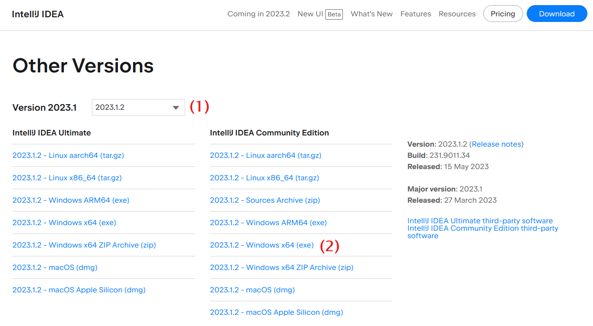

With the installer downloaded, double-click to run it.

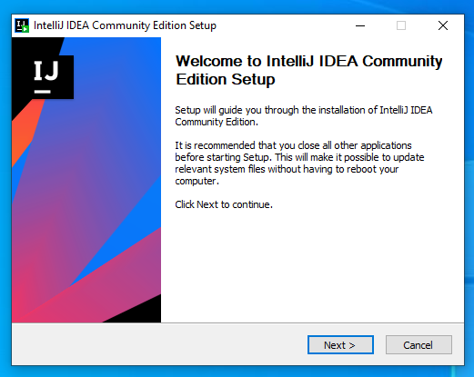

Unless you have a particular reason to do otherwise, the default responses to the installer’s questions will do.

If you’re going to continue to the next step right away, you may as well check the **Run IntelliJ** checkbox in the last screen.

### Step 2/7 - Launching IntelliJ

If you didn't already start IntelliJ at the end of the previous step, do it now. You can do that via the Start menu, for example (or via the file `idea64.exe` that is under the folder where you installed IntelliJ, in the bin subfolder).

On first launch, IntelliJ may ask you about sharing usage data and importing old settings. You can pick **Do not import settings** and press **OK**. Press **Start using IntelliJ IDEA**.

### Step 3/7 - Installing required plugins

On the left side of the newly opened IntelliJ window, there will be a **Plugins (3)** section. Click it to open the plugin marketplace.

(If you already skipped past the initial IntelliJ window, do not worry. You can open the plugin marketplace by going to **File -> Settings** and selecting the **Plugins** tab on the left.)

In the search field **(4)**, enter _Python Community Edition_ and select the first plugin in the search results. Press **Install (5)** to enable Python support in IntelliJ.

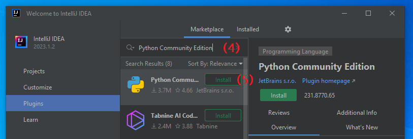

In the same search field as before, enter _A+ Courses_. Select the first recommended plugin and press **Install (6)**.

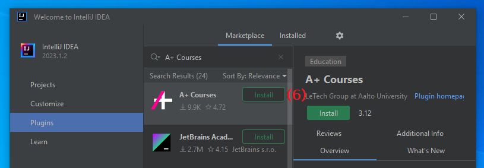

IntelliJ might notify you about installing a third-party plugin. Press **Accept (7)** to okay that.

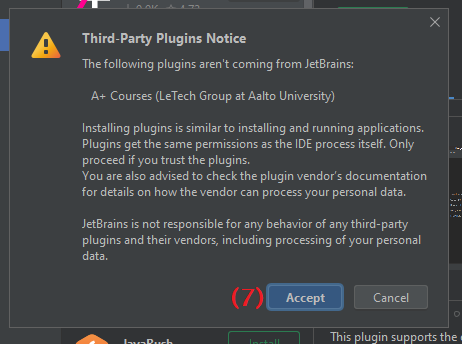

IntelliJ informs you that A+ Courses requires the Scala plugin to be installed as well. Press **Install (8)**. (This is an internal requirement of the plugin; you won't be actually writing any Scala code.)

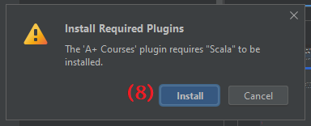

Press **Restart IDE** to finish up the installation. 
- If that button fails to show up, close IntelliJ yourself and relaunch it.
- When restarting, you may be given a brief notice about “indexing” being unfinished. Don’t worry about it.

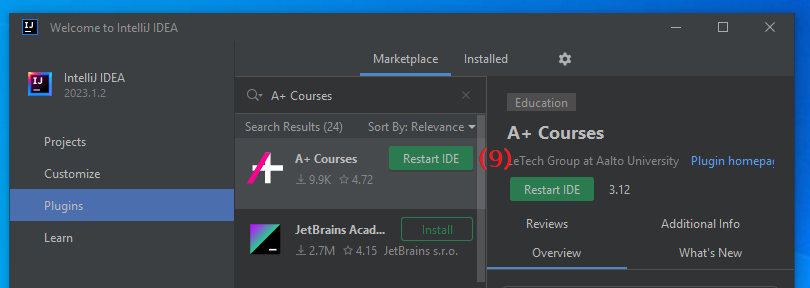

### Step 4/7 - Creating a project

After restarting IntelliJ, you will be prompted to create or select a **project** for your work. Select **New Project (10)**.

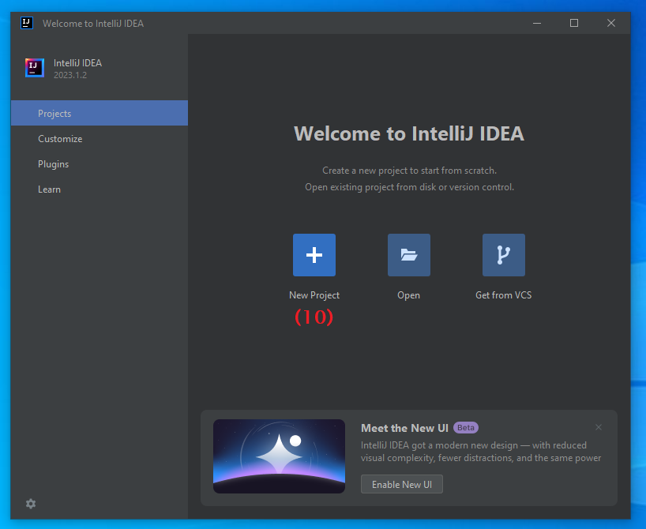

At the next prompt, select **A+ Courses (11)** from the template list on the left, and press **Next (12)**.

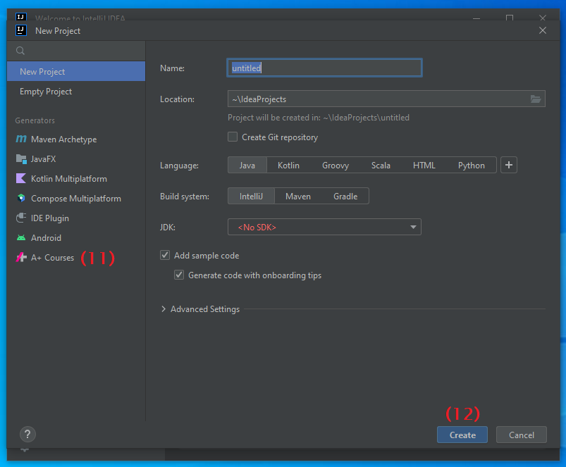

In the field **Project name (13)**, write a suitable name for your course project, such as _dsa2023_ or _dsaexercises_. Under **Project location (14)**, you can mark which folder you’d like IntelliJ to store your files in; the suggested default will do, unless you wish to change it.

Press **Create (15)**. IntelliJ launches and shows you a tip-of-the-day, which you may close. A new empty project remains open.

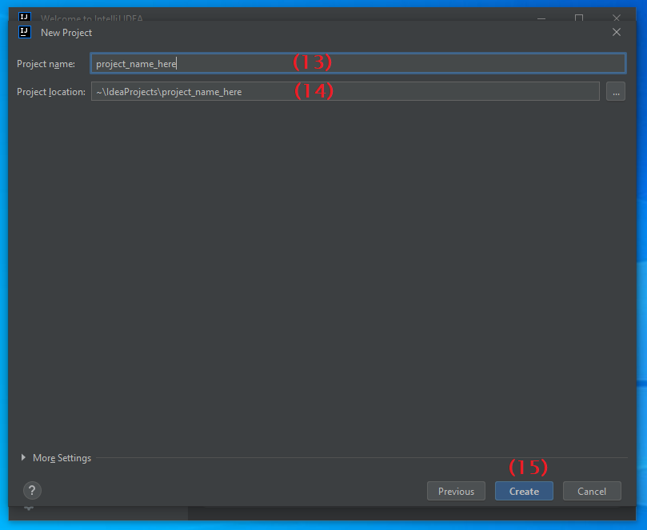

### Step 5/7 - Selecting the Python SDK

After creating a new IntelliJ project, a **Project Structure** window will automatically open. If it did not, go to **File -> Project Structure**.

Select the **Project (16)** tab from the list on the left. You should see a drop-down menu named **SDK**. In that menu, choose **Add SDK -> Python SDK (17)**.

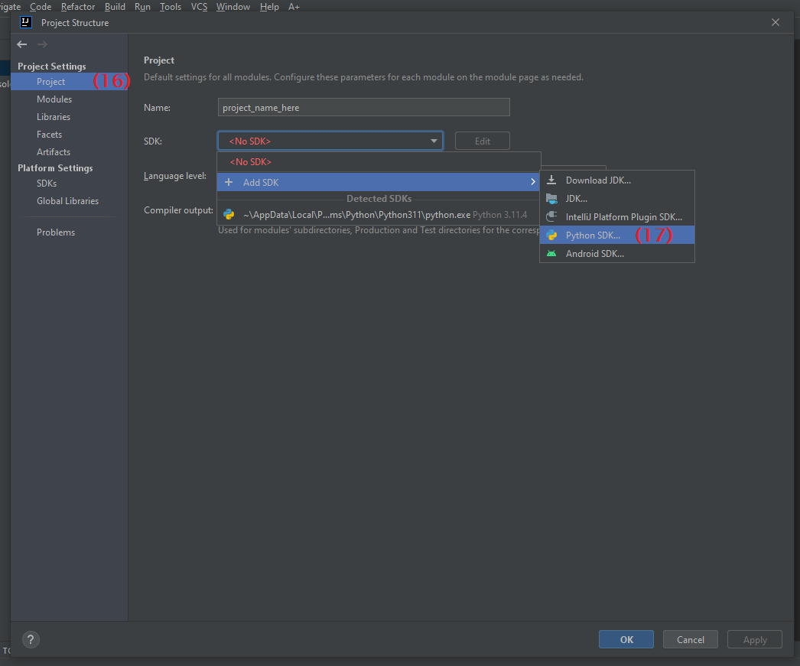

A new window will open. The default options will do fine, but you might need to adjust the **base interpreter (18)** path if you have several versions of Python installed. Choose the latest one available (in this example, Python 3.10 is selected) and press **OK**.

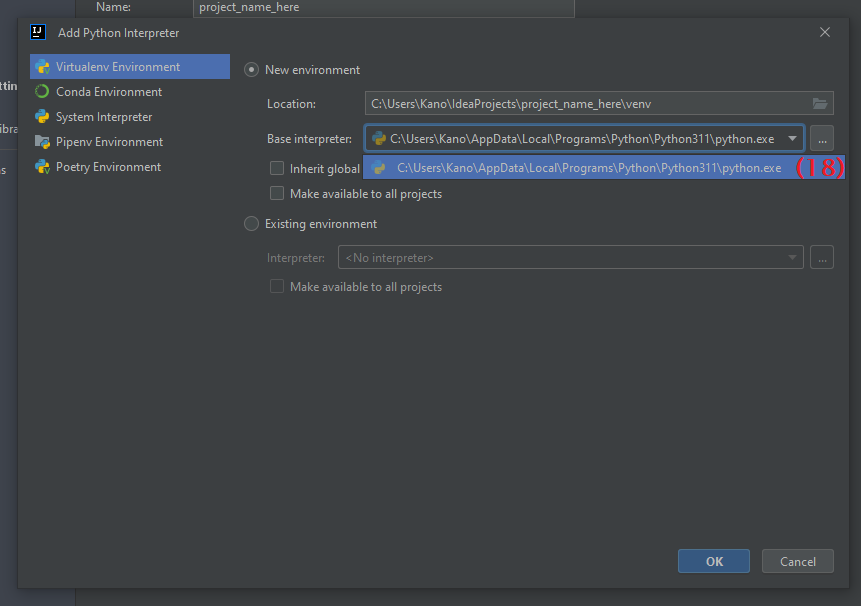

Close the **Project Structure** window by pressing OK.

### Step 6/7 - Install IntelliJ

Once you have created an IntelliJ project, look at the main menu bar at the top. You’ll find a new **A+** menu. Click on it and select **A+ -> Link Project to an A+ Course (19)**.

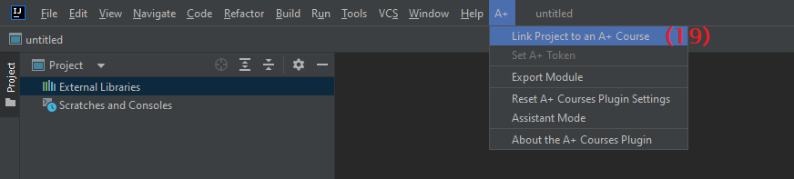

A small dialog window pops up for selecting the course you are taking. **Select the desired course (20)** and press **OK (21)**.

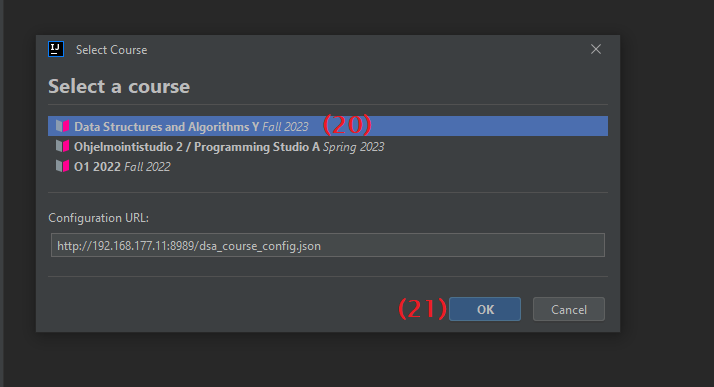

A language menu appears; select the **English version (22)** and press **OK (23)**.

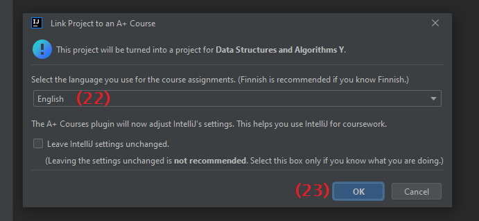

IntelliJ suggests a restart to apply the new settings; accept the prompt. After IntelliJ restarts, you will be greeted with an IntelliJ project linked to an A+ course.

### Step 7/7 - Configuring A+ access in IntelliJ

Before you can download modules and submit assignments, you’ll need to give IntelliJ permission to act in your name in A+. You do that by giving IntelliJ a "passcode" (properly known as an _API Access Token_).

On the right side of the IntelliJ window, there will be a section dedicated to the A+ courses plugin. Press the **Set A+ Token (24)** button.

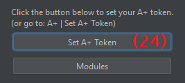

In the newly opened dialog box, press the **"What is my token" link (25)**.

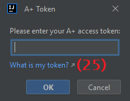

The A+ profile page will open; if it didn't, [click here.](https://plus.cs.aalto.fi/accounts/accounts/) **Copy the API token (26)** from the page and paste it into the dialog box inside IntelliJ.

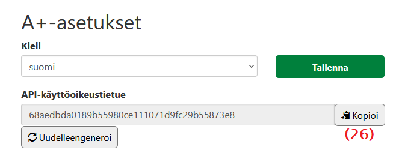

After pasting the token, press **OK (27)**.

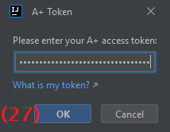

Congratulations! You have successfully created an IntelliJ project with Python support. The configuration is now complete.

Note: font used for screenshot markings: Lucida Sans Unicode, size 18
