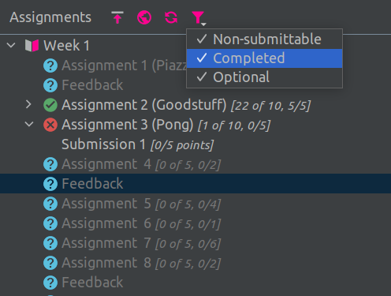

# 

This repository hosts the source code for the A+ Courses [IntelliJ IDEA](https://www.jetbrains.com/idea/) plugin communicating with the [A+ LMS](https://apluslms.github.io/). It allows users to download code modules, submit assignments, and use the Scala REPL more conveniently among other learning experience improvements. The plugin is currently used in introductory programming courses taught at Aalto University ([Programming 1](https://oodi.aalto.fi/a/opintjakstied.jsp?OpinKohd=1125585231&haettuOpas=-1&Kieli=6) and [Programming Studio 2/A](https://oodi.aalto.fi/a/opintjakstied.jsp?OpinKohd=1125591784&haettuOpas=-1&Kieli=6)).

The project is developed under the [Aalto Le-Tech research group](https://research.cs.aalto.fi/LeTech/) and is steered by **[Juha Sorva](https://github.com/jsorva)** and **[Otto Seppälä](https://github.com/oseppala)**.

## Features and Further Development

Most of the available features are described in the [testing manual](https://github.com/Aalto-LeTech/intellij-plugin/blob/master/TESTING.md), which is also used internally for testing. There's also a basic video presentation of the A+ Courses plugins functionality stored [here](https://aalto.cloud.panopto.eu/Panopto/Pages/Viewer.aspx?id=42740f68-8dd8-4ba2-8f1c-acb1007bf8ef).

The roadmap and plans for the future development of the plugin are in the [project wiki](https://github.com/Aalto-LeTech/intellij-plugin/wiki/Requirements). The list of requirements is in no way final and we [welcome all input and ideas](https://github.com/Aalto-LeTech/intellij-plugin/issues/new/choose) on how to make this plugin better.

## Maintenance

If you are a student in a course and you have discovered an issue you'd like to report, please turn to the teaching assistants. You can also create an issue directly here: [Aalto-LeTech/intellij-plugin/issues](https://github.com/Aalto-LeTech/intellij-plugin/issues).

Once the bug report is made, the development team (**[@jaakkonarhi](https://github.com/jaakkonarhi)**, **[@nikke234](https://github.com/nikke234)**, **[@OlliKiljunen](https://github.com/OlliKiljunen)**, **[@stellatsv](https://github.com/stellatsv)**, **[@superseacat](https://github.com/superseacat)**, **[@Taikelenn](https://github.com/Taikelenn)**) will handle it on a **best-effort basis:**

1. The issue will be confirmed and prioritized within **two working days**.
2. An estimation of when the issue could be fixed is made within **three working days**.
3. Once the issue is fixed, it will take at most two working days until the fix is publicly available in the [JetBrains plugin repository](https://plugins.jetbrains.com/plugin/13634-a-courses), 
and, eventually, your IDE.

Medium- to high-priority issues are usually solved within **one working-week**.

## Code Style

This project uses slightly modified google checkstyle rules from [Checkstyle GitHub](https://github.com/checkstyle/checkstyle/blob/checkstyle-8.12/src/main/resources/google_checks.xml) for code formatting. The particular version applied to this project is in the `checkstyle` directory. Please note that the checkstyle file itself is licensed under the **GNU LGPL** license (also in the directory). Scala code is checked using the [default rules from the scalastyle repository](https://github.com/scalastyle/scalastyle/blob/master/src/main/resources/default_config.xml). The configuration file is located in the `scalastyle` directory and it is licensed under the **Apache-2.0** license.  

## Code of Conduct

The team follows general principles of Aalto University's [code of conduct](https://www.aalto.fi/sites/g/files/flghsv161/files/2018-09/aalto_university_code_of_conduct_en-003.pdf).

## Credits

We would like to acknowledge **[@valtonv2](https://github.com/valtonv2)**, **[@xiaoxiaobt](https://github.com/xiaoxiaobt)**, **Ida Iskala**, and **[@StanislavFranko](https://github.com/StanislavFranko)** for their help in testing and improving this project.
