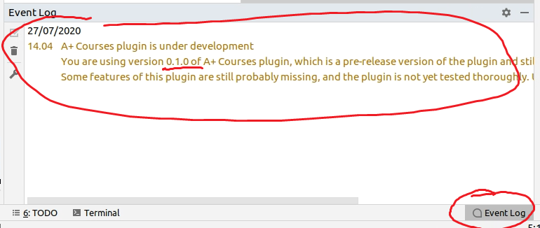

Manual testing
==============

[The complete list](https://github.com/Aalto-LeTech/intellij-plugin/labels/manual%20testing)
of features that require writing a manual testing manual.
Marked with a github issue label "manual testing."

### Notes

+ The menus of IntelliJ are bit different on Mac than on Linux/Windows.
  For example, to open settings on Linux, one can navigate to **File > Settings...**
  but on Mac, the same thing is achieved with **IntelliJ IDEA > Preferences...**.

+ Similarly, on Mac one does not use right-click
  but, instead, clicks holding **Ctrl** key down.

### 0 Setup

**0.1** Make sure you are using a clean installment of
        **IntelliJ IDEA Community** version **2020.1**.
- You can download IntelliJ IDEA Community from https://www.jetbrains.com/idea/download.
- In case you use pre-existing installment of IntelliJ IDEA,
  you can use one of the following ways to restore to the default settings:

**0.1.A.** In the main window, choose **File > Manage IDE Settings > Restore Default Settings...**
- In the popup window, choose **Restore and restart**.

**0.1.B** In the startup window, choose **Configure > Restore Default Settings...**
- In the popup window, choose **Restore and restart**.

**0.2** When the IntelliJ IDEA opens first time, choose **Light** UI theme and
        click **Skip Remaining and Set Defaults**.

**0.3** Remove installed external plugins, if there are any.
- In the startup window, choose **Configure > Plugins** and open **Installed** tab.
- If there are **Downloaded** plugins on the top of the list,
  uninstall all of them, one by one.
- Restart IntelliJ IDEA.

### 1 Install **A+ Courses** plugin.

**1.1** In the startup window, choose **Configure > Plugins**.

**1.2** Do one of the following options, depending on whether you are testing
        a pre-publish version of the plugin or a published version.

**1.2.A** Install a pre-publish version.
- If you don't have a ZIP file yet, you can generate it.
  To get the source code, execute

      git clone https://github.com/Aalto-LeTech/intellij-plugin.git

  and navigate to the cloned directory.
  Checkout the branch/tag/commit you want to test, and execute
 
      ./gradlew buildPlugin
  
  Once the build is ready,
  the generated ZIP file can be found in `build/distributions`.
- In **Plugins** window, click the cog icon next to the tabs.
- From a popup menu, choose **Install Plugin from Disk...**
- Select the ZIP file on the popped-up file selector.

**1.2.B** Install a published version.
- Open **Marketplace** tab and search **A+ Courses** plugin.
- Ensure that the version is the one you want to test.
- Click **Install**.

**1.3** Exit **Plugins** window by clicking **OK**.

**1.4** ASSERTION: IntelliJ IDEA does not request a restart.

### 2 Initialize a new project

**2.1** In the startup window, click **Create New Project**.

**2.2** In **New Project** window, choose **Empty Project** on a left-hand side list.

**2.3** Click **Next**.

**2.4** On the next view, click **Finish**.

**2.5** If **Tip of the Day** window is shown,
        check **Don't show tips** and click **Close**. 

**2.6** ASSERTION: **Project Structure** window opens with **Modules** tab visible.

**2.7** Switch to **Project** tab.

**2.8** ASSERTION: **Project SDK** reads **\<No SDK\>**.

**2.9** Choose JDK 11 as **Project SDK**.
- If JDK 11 is not installed on the computer,
  choose **Add SDK > Download JDK...**
- On the window that opens,
  choose **AdoptOpenJDK (HotSpot)** as **Vendor**
  and **11.x.x** as **Version**,
  and click **Download**.

**2.10** Click **OK** to close **Project Structure** window.

### 3 Observe startup notification

**3.1** ASSERTION: The screen shows a notification telling
        you are using a pre-release version of the plugin.

**3.2** ASSERTION: The version mentioned in the notification is correct.

- You can check the version of the plugin in **File > Settings... > Plugins > Installed**

### 4 Observe Scala plugin notification

**4.1** ASSERTION: The screen shows a notification telling the Scala plugin is not installed.
- The notification has a clickable option to install Scala plugin.

**4.2** Click the highlighted part of the notification.

**4.3** The screen shows a dialog asking if the user wants to restart to apply changes.
        Click **Yes**.

**4.4** The IDE restarts.

**4.6** ASSERTION: No notification about Scala plugin is shown anymore.

**4.5** ASSERTION: Scala plugin is installed.
- Navigate to **File > Settings... > Plugins > Installed** to see this. 

**4.7** Disable Scala plugin.

**4.8** Restart the IDE.

**4.9** ASSERTION: The screen shows a notification telling the Scala plugin is disabled.

- The notification has a clickable option to enable Scala plugin.

**4.10** Click the highlighted part of the notification.

**4.11** The screen shows a dialog asking if the user wants to restart to apply changes.
        Click **Yes**.

**4.12** The IDE restarts.

**4.13** ASSERTION: No notification about Scala plugin is shown anymore.

**4.14** ASSERTION: Scala plugin is enabled.
- Navigate to **File > Settings... > Plugins > Installed** to see this.

### 5 About window

**5.1** From the main menu, choose **A+ > About A+ Plugin**.

**5.2** The about window is shown.

**5.3** Close the window by clicking **OK**.

### 6 Turn project into A+ project

**6.1** From the main menu, choose **A+ > Turn project into A+ course project**.

**6.2** On the dialog that opens, click **Cancel**.

**6.3** ASSERTION: The dialog closes but nothing else seems to happen.

**6.4** Open **A+ > Turn project into A+ course project** again.

**6.5** ASSERTION: **Leave IntelliJ settings unchanged** checkbutton is not checked.

**6.6** Check "leave unchanged" checkbox and click OK.

**6.7** ASSERTION: **O1Library** appears as a module in the project tree.

**6.8** ASSERTION: **A+ Courses** tool window shows a list of O1 modules in **Modules** list.

**6.9** ASSERTION: **O1Library** is marked **Installed** in **Modules** list.

**6.10** Once again, navigate to **A+ > Turn project into A+ course project**.

**6.11** Leave the checkbox unchecked and click **OK**.

**6.12** The screen shows a dialog that tells the IDE will be restarted.

**6.13** Click **OK**.

**6.14** The IDE restarts.

**6.15** ASSERTION: The theme has changed to dark.

### 7 Importing modules

**7.1** On **Modules** list  tool window, double-click **RobotTribes**.

**7.2** ASSERTION: **RobotTribes** and **Robots** appear as modules in the project tree.

**7.3** ASSERTION: **RobotTribes** and **Robots** are marked **Installed** in **Modules** list.

**7.4** On **Modules** list, right-click **SwingExamples**.

**7.5** On the context menu that appears, choose **Import A+ module**.

**7.6** ASSERTION: **SwingExamples** appears as a module in the project tree.

**7.7** ASSERTION: **SwingExamples** is marked **Installed** in the modules list.

**7.8** On **Modules** list, select multiple uninstalled modules.
- Hold **Ctrl**/**Cmd** key down while clicking to select many items.

**7.9** Click the button with download icon
        on the top of the **Modules** list
        to install all selected modules.

**7.10** ASSERTION: The chosen modules appear in the project tree.

**7.11** ASSERTION: The chosen modules are marked **Installed** in **Modules** list.

**7.12** ASSERTION: All the installed modules have their dependencies correctly configured.
- To check this, navigate to **File > Project Structure... > Modules**
  and make sure none of the modules is underlined in red.
- Exit **Project Structure** window by clicking **Cancel**.

### 8 Using Scala REPL

#### Part I: Basic case

**8.1** Open REPL by choosing a folder or a file within **SwingExamples** module.
- Read [this](https://confluence.jetbrains.com/pages/viewpage.action?pageId=53326891)
  if you don't know how to open and use REPL.

**8.2** In **REPL configuration** window that opens,
        uncheck **Don't show this window again** checkbox.

**8.3** Click **OK**.

**8.4** ASSERTION: A REPL opens with **SwingExamples** in its title. 

**8.5** ASSERTION: Welcome message contains the **SwingExamples** as module name and a list of 
imported packages: **o1, o1.llama, o1.randomtext**.

**8.6** ASSERTION: Welcome message contains `[Ctrl+Enter]` as one of the available commands.

**8.7** Execute the following command in REPL:

    val RTA = RandomTextApp

**8.8** ASSERTION: Results of the command has no errors and looks alike the following image.

**8.9** Execute the following two commands in REPL:

    sys.props("user.dir")
    sys.props("java.class.path")

**8.10** ASSERTION: The output of the first statement is the directory of **SwingExamples** module.

**8.11** ASSERTION: The output of the second statement (classpath) contains **SwingExamples**.

**8.12** Close the REPL by clicking X next to its tab title.

**8.13** The window opens asking whether REPL should be terminated.
        Check **Remember, don't ask again** checkbox and click **Terminate**.

#### Part II: Changing parameters

**8.14** Reopen REPL by choosing a folder or a file within **SwingExamples** module.

**8.15** Again, uncheck **Don't show this window again** checkbox.

**8.16** Change **Working directory** to be the directory of **O1Library** module.
- Just replacing **SwingExamples** with **O1Library** in the path does the trick.

**8.17** Change value for **Use classpath and SDK of module** dropdown list to be **O1Library**.

**8.18** Click **OK**.

**8.19** ASSERTION: A REPL opens with **O1Library** in its title.

**8.20** In REPL, execute the same two commands as in **8.9**.

**8.21** ASSERTION: The output of the first statement is the directory of **O1Library** module.

**8.22** ASSERTION: The output of the second statement (classpath) contains **O1Library**
         (but not other modules, such as **SwingExamples**).

**8.23** Close the REPL.

#### Part III: Inconsistent parameters

**8.24** Reopen REPL by choosing a folder or a file within **O1Library** module.

**8.25** This time, leave **Don't show this window again** checkbox checked.

**8.26** Change **Working directory** to be the directory of **SwingExamples** module.

**8.27** Click **OK**.

**8.28** ASSERTION: A REPL opens with **O1Library** in its title.

**8.29** In REPL, execute the same two commands as in **8.9**.

**8.30** ASSERTION: The output of the first statement is the directory of **SwingExamples** module.

**8.31** ASSERTION: The output of the second statement (classpath) contains **O1Library**
         (but not other modules, such as **SwingExamples**).

**8.32** Close the REPL.

#### Part IV: Persistence of choice

**8.33** Reopen REPL by choosing a folder or a file within **O1Library** module.

**8.34** ASSERTION: **REPL Configuration** window does not show up.

**8.35** ASSERTION: A REPL opens with **O1Library** in its title.

**8.36** Execute the same two commands as in **8.9**.

**8.37** ASSERTION: The output of the first statement is the directory of **O1Library** module.

**8.38** ASSERTION: The output of the second statement (classpath) contains **O1Library**
         (but not other modules, such as **SwingExamples**).

**8.39** Close the REPL.

**8.40** Restart te IDE.

**8.41** Once the IDE has restarted, open the REPL by choosing any file.

**8.42** ASSERTION: **REPL Configuration** window does not show up.

**8.43** ASSERTION: A REPL opens.

**8.44** Close the REPL.

#### Part V: Settings reset.

**8.45** From the main menu, choose **A+ > Reset A+ Courses Plugin Settings**.

**8.46** Open REPL by choosing any file.

**8.47** ASSERTION: **REPL Configuration** window shows up.

**8.48** Close the window by clicking **Cancel**.

**8.49** ASSERTION: No REPL opens.

### 9 Removing a module

**9.1** Right-click **SwingExamples** in the project tree
        and choose **Remove Module** from the context menu.

**9.2** Confirm the removal by clicking **Remove** on a popup window.

**9.3** ASSERTION: **SwingExamples** no longer shows **Installed** in **Modules** list.

**9.4** Double click **SwingExamples** in **Modules** list.

**9.5** ASSERTION: **SwingExamples** shows up as a module in the project tree.
