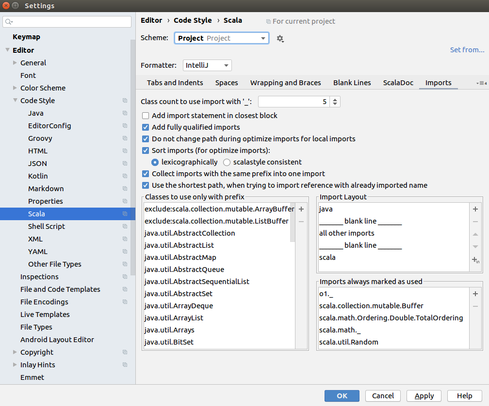

## Manual testing ##

[The complete list](https://github.com/Aalto-LeTech/intellij-plugin/labels/manual%20testing) of features that require writing
a manual testing manual. Marked with a github issue label "manual testing".

  

    <a href="https://github.com/Aalto-LeTech/intellij-plugin/issues/9">making hints on missing plugins #9</a>
  

  

    <h5>Part 1. Checking missing plugins</h5>
    <ol>
      <li>Ensure "Scala" plugin is not installed <b>(File | Settings | Plugins | Marketplace)</b></li>
      <li>Restart an IDE</li>
      <li>Observe a notification saying
         
        <i>
        "A+
        The additional plugin(s) must be installed and enabled for the A+ plugin to work properly (Scala).
         
        <a href="">Install missing (Scala) plugin(s).</a>"
       </i>
      </li>
      <li>Click on the highlighted part of the notification, approve restart of the IDE</li>
      <li>After the restart is done, ensure there is no notification anymore</li>
    </ol>
  

  

    <h5>Part 2. Checking disabled plugins</h5>
    <ol>
      <li>Ensure 'Scala' plugin is installed and disabled
        
      </li>
      <li>Restart an IDE</li>
      <li>Observe a notification
        
      </li>
      <li>Click on the highlighted part of the notification</li>
      <li>Check the notification became inactive
        
      </li>
      <li>After the restart is done, ensure there is no notification anymore</li>
    </ol>  
  

  

    <a href="https://github.com/Aalto-LeTech/intellij-plugin/issues/44">add new startup notification saying the plugin is in beta/dev #44</a>
  

  

    <h5>Checking the notification regard the current A+ Course plugin version</h5>
    <ol>
      <li>Ensure "A+ Course" plugin is installed <b>(File | Settings | Plugins | Installed)</b> and check the plugin version from the plugin window or <a href="https://plugins.jetbrains.com/plugin/13634-a-plugin-for-intellij/versions">online.</a></li>
      <li>Restart an IDE</li>
      <li>Observe a notification saying and ensure the version matches the one shown for the plugin.
         
        <i>
          "A+ Courses plugin is under development: You are using version <b>0.1.0</b> of A+ Courses plugin, which is a pre-release version of the plugin and still under development. Some features of this plugin are still probably missing, and the plugin is not yet tested thoroughly. Use this plugin with caution and on your own risk!
       </i>
      </li>
      <li>The notification should remain after the restart is done.</li>
    </ol>
  

  

    <a href="https://github.com/Aalto-LeTech/intellij-plugin/issues/30">install required
    dependencies for the project from LOCAL #30</a>
  

  

    <h5>Part 1. Importing a module by double-clicking it</h5>
    <ol>
      <li>Create a new project.</li>
      <li>
        Open the <em>Modules</em> tool window (if it is not open). You may have to wait a
        few seconds for the list of modules to be initialized. If the initialization takes more
        than 10&nbsp;seconds, consider it an error.
      </li>
      <li>Select <em>GoodStuff</em> from the list and double click it.</li>
      <li>
        Ensure that <em>GoodStuff</em> and <em>O1Library</em> appear as loaded modules in the
        project tree, and their contents match the image below: 
        
      </li>
      <li>
        Ensure that <em>GoodStuff</em> and <em>O1Library</em> are marked <em>Installed</em> in the
        <em>Modules</em> tool window.
      </li>
      <li>
        From <i>File</i> menu, open <i>Project Structure...</i> and navigate to <i>Modules</i> page
        (under <i>Project Settings</i>).  Ensure that <em>GoodStuff</em> and <em>O1Library</em> are
        listed there and neither of them is marked red (signaling missing dependencies).
      </li>
    </ol>
  

  

    <h5>Part 2. Importing a module using context menu.</h5>
    <ol>
      <li>
        Continuing from <strong>Part 1</strong>, right-click a non-installed module of your choice
        in the <em>Modules</em> tool window. On Mac with only one mouse button, you may need
        to use some other gesture to open a context menu, like holding <em>Ctrl</em> key while
        clicking. Use the way that is standard to the system.
      </li>
      <li>Ensure that a pop-up menu appears next to the mouse pointer.</li>
      <li>Click <em>Import A+ Module</em> menu item.</li>
      <li>
        Ensure that the module appears in the project tree. If module has dependencies, those
        are imported too. If other modules appear in the project tree in this step, you can assume
        they are dependencies of the module you chose and ignore them.
      </li>
      <li>
        Ensure that the module is marked <em>Installed</em> in the <em>Modules</em> tool window.
      </li>
    </ol>
  

  

    <h5>Part 3. Importing multiple modules using toolbar button.</h5>
    <ol>
      <li>
        Continuing from <strong>Part 2</strong>, select multiple non-installed modules in the
        <em>Modules</em> tool window by clicking them while holding <em>Ctrl</em> key.
        Again, Mac may do things differently, so use the way to select multiple items that is
        standard to the system.
      </li>
      <li>
        Click <em>Import A+ Module</em> toolbar button on the top of the <em>Modules</em> tool
        window. The button is denoted with a "download" icon.
      </li>
      <li>
        Ensure that the selected modules appear in the project tree. Again, in case other
        modules appear there as well, assume they are appropriate dependencies and ignore them.
        
      </li>
      <li>
        Ensure that the modules you selected are marked <em>Installed</em> in the <em>Modules</em>
        tool window.
      </li>
    </ol>
  

  

    <a href="https://github.com/Aalto-LeTech/intellij-plugin/issues/92">implement REPL thingy #92</a>
  

  

    <h5>Part 1. Importing a module</h5>
    <ol>
      <li>Create a new project.</li>
      <li>
        Open the <em>Modules</em> tool window (if it is not open). You may have to wait a
        few seconds for the list of modules to be initialized. If the initialization takes more
        than 10&nbsp;seconds, consider it an error.
      </li>
      <li>Select <em>GoodStuff</em> from the list and double click it to install the module.</li>
    </ol>
  

  

      <h5>Part 2. Verifying the REPL</h5>
      <ol>
        <li>Ensure Scala Plugin is installed and enabled</li>
        <li>Ensure Scala SDK is set properly <b>(File | Project Structure | Global Libraries | Add | Scala SDK)</b></li>
        <li>Open REPL by choosing a folder or a file within <em>GoodStuff</em> module <a href="https://confluence.jetbrains.com/pages/viewpage.action?pageId=53326891">(how-to)</a></li>
        

          <h6>Part 2.1. REPL configuration dialog is shown, checkbox unchecked</h6>
            <ol>
            <li>When the REPL configuration dialog, that looks like the following image is shown, uncheck the "Don't show this window again" checkbox, click <em>OK</em>.</li>
            <li>Ensure the REPL that looks like the next one is shown. </li>
            <li>Close the REPL and start it again.</li>
            <li>Ensure the REPL configuration dialog is shown, click "Cancel".</li>
            </ol>
        

        

          <h6>Part 2.2. REPL configuration dialog is shown, checkbox unchecked, valid changes</h6>
            <ol>
            <li>When the REPL configuration dialog, that looks like previous image is shown, uncheck the "Don't show this window again" checkbox.</li>
            <li>Under "User classpath and SDK of module" change the module to be <em>"O1Library"</em>, also select <em>"O1Library"</em>'s files source as a "Working directory", click <em>OK</em>.</li>
            <li>Ensure the REPL that looks like like the next one is shown, then close REPL. </li>             
            </ol>
        
 
        

          <h6>Part 2.3. REPL configuration dialog is shown, checkbox unchecked, invalid changes</h6>
            <ol>
            <li>When the REPL configuration dialog, that looks like previous image is shown, uncheck the "Don't show this window again" checkbox.</li>
            <li>Under "User classpath and SDK of module" change the module to be <em>"O1Library"</em>, also select <em>"GoodStuff"</em>'s files source as a "Working directory", click <em>OK</em>.</li>
            <li>Ensure the REPL that looks like the next image is shown, close the REPL.</li>
            </ol>
        

        
              
          <h6>Part 2.4. REPL configuration dialog is cancelled</h6>
          <ol>
          <li>Click <em>Cancel</em> when the REPL configuration dialog is shown and observe nothing happens.</li>
          </ol>
         
               
        

          <h6>Part 2.5. REPL configuration dialog is shown, checkbox checked</h6>
          <ol>
          <li>Click <em>OK</em> when the REPL configuration dialog, that looks like the one displayed is shown.</li>
          <li>Ensure proper REPL is started.</li>
          <li>Close the REPL and start it again.</li>
          <li>Ensure the no REPL configuration dialog is shown.</li>
          </ol>
        

        <h6>After each sub-part (2.x)</h6>
        <li>When the console opens, check, that the name of the REPL contains the name of the <em>GoodStuff</em> (selected module or "&lt;?&gt;")</li>
        <li>Next, type into the REPL prompt: <i>sys.props("user.dir")</i>
        </li>
        <li>Make sure, that the output directory is where the <em>GoodStuff</em> (selected) module resides</li>
        <li>Next, type into the REPL prompt: <i>sys.props("java.class.path")</i></li>
        <li>Make sure, that the output classpath contains the <em>GoodStuff</em> (selected) module, the complete result should look approximately like this:
         
        </li>
      </ol>
    

  

    <a href="https://github.com/Aalto-LeTech/intellij-plugin/issues/117">Import IDE settings from remote #117</a>
  

  

    <h5>Part 1. Testing the error message</h5>
    <ol>
      <li>Start the IDE and make sure the course has been loaded (check the modules list for an example).</li>
      <li>Disable networking from the computer.</li>
      <li>Attempt to import course IDE settings from the A+ menu in the top toolbar.</li>
      <li>Observe an error message dialog that notifies the user that an error occurred.</li>
    </ol>
  

  

    <h5>Part 2. Importing IDE settings</h5>
    <ol>
      <li>Import course IDE settings from the A+ menu in the top toolbar.</li>
      <li>Observe a confirmation message dialog, which warns the user that settings are overwritten.</li>
      <li>After the IDE settings have been imported, observe a message dialog proposing a restart.</li>
      <li>
      After restarting the IDE, ensure that the settings have been successfully imported.
      For an example, the IDE should now be in dark mode.
      </li>
    </ol>
  

  

    <a href="https://github.com/Aalto-LeTech/intellij-plugin/issues/118">Import project settings from remote #118</a>
  

  

    <h5>Importing Project Settings</h5>
    <ol>
      <li>Create a new project and expand the <code>.idea</code> directory in the project tool window on the left.</li>
      <li>Import course project settings from the A+ menu in the top toolbar.</li>
      <li>Observe that the project is reloaded and the <code>.idea</code> directory should now contain new files.</li>
      <li>Navigate to <code>File -> Settings... -> Editor -> Code Style -> Scala</code>.</li>
      <li>Change the "Scheme" to "Project" to show project settings.</li>
      <li>
      Open the "Imports" tab and note that there are O1 related items in the "Imports always marked as used"
      box at the bottom right:
      
      </li>
    </ol>
  

  

    <a href="https://github.com/Aalto-LeTech/intellij-plugin/issues/110">Renaming/removing module files leads to incorrect states in module list #110</a>
  

  

    <h5>Part 1. Removing a module</h5>
    <ol>
      <li>Create a new project and import <i>GoodStuff</i> module.</li>
      <li>Right click the <i>O1Library</i> from the project tree and choose <i>Remove Module</i> from the popup menu.</li>
      <li>Choose <i>Remove</i> from the popup window.</li>
      <li>Ensure that <i>O1Library</i> is marked not installed in the modules list.</li>
      <li>Ensure that <i>GoodStuff</i> is marked "error in dependencies" in the modules list.</li>
    </ol>
  

  

    <h5>Part 2. Reinstalling a module</h5>
    <ol>
      <li>Continuing from Part 1, double-click <i>O1Library</i> in the modules list to re-install it.</li>
      <li>Ensure that <i>O1Library</i> shows loaded as a module in the project tree (it has the blue square symbol).</li>
      <li>Ensure that <i>O1Library</i> and <i>GoodStuff</i> are marked installed in the modules list.</li>
    </ol>
  

  

    <h5>Part 3. Removing and reinstalling Scala SDK</h5>
    <ol>
      <li>Continuing from Part 3, delete the directory of Scala SDK inside the <code>lib</code> directory.</li>
      <li>Ensure that <i>O1Library</i> and <i>GoodStuff</i> are marked "error in dependencies" in the modules list.</li>
      <li>Double-click <i>O1Library</i> in the modules list to re-install it.</li>
      <li>Ensure that <i>O1Library</i> and <i>GoodStuff</i> are marked installed in the modules list.</li>
    </ol>
  

