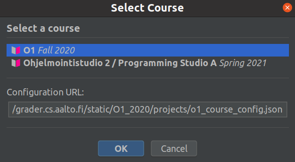
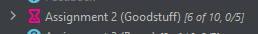
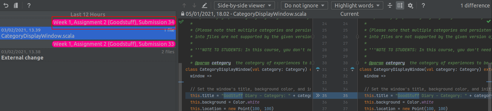
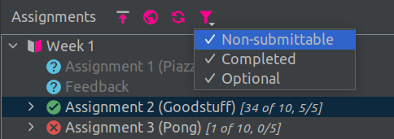

Manual testing
==============

### Notes

+ The menus of IntelliJ are a bit different on Mac than on Linux/Windows. For example, to open settings on Linux, one
  can navigate to **File > Settings...**
  but on Mac, the same result is achieved with **IntelliJ IDEA > Preferences...**.

+ Similarly, on Mac one does not use right-click but, instead, clicks holding **Ctrl** key down.

### 0 Setup

**0.1** Make sure you are using a clean installation of
**IntelliJ IDEA Community** version **2021.2**.

- You can download IntelliJ IDEA Community from https://www.jetbrains.com/idea/download.
- In case you use an existing install of IntelliJ IDEA, you can use one of the following ways to restore to the default
  settings:

**0.1.A.** In the main window, choose **File > Manage IDE Settings > Restore Default Settings...**

- In the popup window, choose **Restore and restart**.

**0.1.B** In the startup window, choose **Configure > Restore Default Settings...**

- In the popup window, choose **Restore and restart**.

**0.2** When the IntelliJ IDEA opens first time, choose **Light** UI theme and click **Skip Remaining and Set Defaults**
.

**0.3** Remove installed external plugins, if there are any.

- In the startup window, choose **Configure > Plugins** and open **Installed** tab.
- If there are **Downloaded** plugins on the top of the list, uninstall all of them, one by one.
- Restart IntelliJ IDEA.

### 1 Install **A+ Courses** plugin

**1.1** In the startup window, choose **Plugins**.

**1.2** Do one of the following options, depending on whether you are testing a pre-publish version of the plugin or a
published version.

**1.2.A** Install a published version.

- Open **Marketplace** tab and search **A+ Courses** plugin.
- Ensure that the version is the one you want to test.
- Click **Install**.

**1.2.B** Install a pre-publish version.

- If you don't have a ZIP file yet, you can generate it. To get the source code, execute

      git clone https://github.com/Aalto-LeTech/aplus-courses.git

  and navigate to the cloned directory. Checkout the branch/tag/commit you want to test, and execute

      ./gradlew buildPlugin

  Once the build is ready, the generated ZIP file can be found in `build/distributions`.
- In **Plugins** window, click the cog icon next to the tabs.
- From a popup menu, choose **Install Plugin from Disk...**
- Select the ZIP file on the popped-up file selector.

**1.3** ASSERTION: IntelliJ IDEA asks to install **Scala Plugin**.

**1.4** Install **Scala Plugin** by clicking **Install**.

**1.5** ASSERTION: IntelliJ IDEA requires a restart.

**1.6** Restart IntelliJ IDEA.

### 2 Initialize a new project

**2.1** In the startup window, click **New Project**.

**2.2** In **New Project** window, choose **A+ Project** on a left-hand side list.

**2.3** Click **Next**.

**2.4** On the next view, click **Finish**.

**2.5** If the **Tip of the Day** window is shown, check **Don't show tips** and click **Close**.

**2.6** ASSERTION: **Project Structure** window opens with **Modules** tab visible.

**2.7** Switch to **Project** tab.

**2.8** ASSERTION: **Project SDK** reads **\<No SDK\>**.

**2.9** Choose JDK 11 as **Project SDK**.

- If JDK 11 is not installed on the computer, choose **Add SDK > Download JDK...**
- On the window that opens, choose **AdoptOpenJDK (HotSpot)** as **Vendor**
  and **11.x.x** as **Version**, and click **Download**.

**2.10** Click **OK** to close **Project Structure** window.

**2.11** Click the **A+ Courses** tab on the right.

**2.12** ASSERTION: There should be 2 labels that inform the user to turn the project into an A+ Project.

### 3 About window

**3.1** From the main menu, choose **A+ > About the A+ Courses Plugin**.

**3.2** ASSERTION: The information window is shown.

**3.3** ASSERTION: The plugin's version is visible near the top of the window.

**3.4** Click the highlighted links.

**3.5** ASSERTION: Each linked page opens in the browser and is relevant.

**3.6** Close the window by clicking **OK**.

### 4 Turn project into A+ project

**4.1** From the main menu, choose **A+ > Turn project into A+ course project**.

**4.2** On the dialog that opens, click **Cancel**.

**4.3** ASSERTION: The dialog closes and nothing else seems to happen.

**4.4** Open **A+ > Turn project into A+ course project** again.

**4.5** ASSERTION: You see a course selection dialog.

**4.6** Select the course O1 and press OK.

**4.7** ASSERTION: **Leave IntelliJ settings unchanged** check box is not checked.

**4.8** Check the "leave unchanged" check box.

**4.9** Select the desired language of assignments submission and click **OK**.

**4.10** ASSERTION: **O1Library** appears as a module in the project tree.

**4.11** ASSERTION: **A+ Courses** tool window shows a list of O1 modules in **Modules** list.

**4.12** ASSERTION: **O1Library** is marked **Installed** in **Modules** list.

**4.13** Once again, navigate to **A+ > Turn project into A+ course project**.

**4.14** ASSERTION: this time the course selection dialog isn't shown, since the project is already a course project.

**4.15** Leave the settings opt-out check box unchecked, select a language, and click **OK**.

**4.16** The screen shows a dialog that tells the IDE will be restarted.

**4.17** Click **OK**.

**4.18** The IDE restarts.

**4.19** ASSERTION: The theme has changed to dark.

**4.20** Click the **A+ Courses** tab on the right.

**4.21** ASSERTION: There should be one label inside the Assignments view informing the user to set the A+ Token.

### 5 Installing modules

**5.1** In the **Modules** list, double-click **RobotTribes**.

**5.2** ASSERTION: **RobotTribes** and **Robots** appear as modules in the project tree.

**5.3** ASSERTION: **RobotTribes** and **Robots** are marked **Installed** in the **Modules** list.

**5.4** In the **Modules** list, right-click **SwingExamples**.

**5.5** In the context menu that appears, choose **Install A+ module**.

**5.6** ASSERTION: **SwingExamples** appears as a module in the project tree.

**5.7** ASSERTION: **SwingExamples** is marked **Installed** in the modules list.

**5.8** In the **Modules** list, select multiple uninstalled modules.

- Hold **Ctrl**/**Cmd** key down while clicking to select many items.

**5.9** Click the button with download icon on the top of the **Modules** list to install all selected modules.

**5.10** ASSERTION: The chosen modules appear in the project tree.

**5.11** ASSERTION: The chosen modules are marked **Installed** in the **Modules** list.

**5.12** ASSERTION: All the installed modules have their dependencies correctly configured.

- To check this, navigate to **File > Project Structure... > Modules**
  and make sure none of the modules is underlined in red.
- Exit **Project Structure** window by clicking **Cancel**.

**5.13** Click anywhere within the **Modules** list.

**5.14** Type the characters *vii* on your keyboard.

**5.15** ASSERTION: The module **Viinaharava** is automatically selected and the substring **Vii** is highlighted.

**5.16** Press **Escape**.

**5.17** ASSERTION: The substring **Vii** should no longer be highlighted.

**5.18** In the **Modules** list, right-click **O1Library**.

**5.19** Choose **Open Documentation** in the context menu.

**5.20** ASSERTION: Scaladoc documentation opens for the **O1Library** module.

### 6 Using Scala REPL

#### Part I: Basic case

**6.1** Open REPL by choosing a folder or a file within **SwingExamples** module.

- Read [this](https://confluence.jetbrains.com/pages/viewpage.action?pageId=53326891)
  if you don't know how to open and use REPL.

**6.2** In **REPL configuration** window that opens, uncheck **Don't show this window again** checkbox.

**6.3** Click **OK**.

**6.4** ASSERTION: A REPL opens with **SwingExamples** in its title.

**6.5** ASSERTION: Welcome message contains the **SwingExamples** as module name and a list of imported packages: **o1,
o1.llama, o1.randomtext**.

**6.6** ASSERTION: Welcome message contains `[Ctrl+Enter]` as one of the available commands.

**6.7** Execute the following command in REPL:

    val RTA = RandomTextApp

**6.8** ASSERTION: Results of the command has no errors and looks alike the following image.

**6.9** Execute the following two commands in REPL:

    sys.props("user.dir")
    sys.props("java.class.path")

**6.10** ASSERTION: The output of the first statement is the directory of **SwingExamples** module.

**6.11** ASSERTION: The output of the second statement (classpath) contains **SwingExamples**.

**6.12** Close the REPL by clicking X next to its tab title.

**6.13** The window opens asking whether REPL should be terminated. Check **Don't ask again** checkbox and click **
Terminate**.

#### Part II: Changing parameters

**6.14** Reopen REPL by choosing a folder or a file within **SwingExamples** module.

**6.15** Again, uncheck **Don't show this window again** checkbox.

**6.16** Change **Working directory** to be the directory of **O1Library** module.

- Just replacing **SwingExamples** with **O1Library** in the path does the trick.

**6.17** Change value for **Use classpath and SDK of module** dropdown list to be **O1Library**.

**6.18** Click **OK**.

**6.19** ASSERTION: A REPL opens with **O1Library** in its title.

**6.20** In REPL, execute the same two commands as in **6.9**.

**6.21** ASSERTION: The output of the first statement is the directory of **O1Library** module.

**6.22** ASSERTION: The output of the second statement (classpath) contains **O1Library**
(but not other modules, such as **SwingExamples**).

**6.23** Close the REPL.

#### Part III: Inconsistent parameters

**6.24** Reopen REPL by choosing a folder or a file within **O1Library** module.

**6.25** Change **Working directory** to be the directory of **SwingExamples** module.

**6.26** This time, leave **Don't show this window again** checkbox checked.

**6.27** Click **OK**.

**6.28** ASSERTION: A Scala REPL opens with **O1Library** in its title.

**6.29** In the REPL, execute the same two commands as in **6.9**.

**6.30** ASSERTION: The output of the first statement is the directory of **SwingExamples** module.

**6.31** ASSERTION: The output of the second statement (classpath) contains **O1Library**
(but not other modules, such as **SwingExamples**).

**6.32** Close the REPL.

#### Part IV: Persistence of choice

**6.33** Reopen REPL by choosing a folder or a file within **O1Library** module.

**6.34** ASSERTION: **REPL Configuration** window does not show up.

**6.35** ASSERTION: A REPL opens with **O1Library** in its title.

**6.36** Execute the same two commands as in **6.9**.

**6.37** ASSERTION: The output of the first statement is the directory of **O1Library** module.

**6.38** ASSERTION: The output of the second statement (classpath) contains **O1Library**
(but not other modules, such as **SwingExamples**).

**6.39** Close the REPL.

**6.40** Restart the IDE.

**6.41** Once the IDE has restarted, open a file from **O1Library** in the editor and start the Scala REPL.

**6.42** ASSERTION: **REPL Configuration** window does not show up.

**6.43** ASSERTION: A Scala REPL for **O1Library** opens.

**6.44** Execute the following command in the REPL: `println("Myöhässä こんにちは世界")`

**6.45** ASSERTION: The characters appear correctly, without any corruption (question marks, missing characters)

**6.46** Close the REPL.

#### Part V: Settings reset.

**6.47** From the main menu, choose **A+ > Reset A+ Courses Plugin Settings**.

**6.48** Open the Scala REPL for **O1Library**.

**6.49** ASSERTION: **REPL Configuration** window shows up.

**6.50** Close the window by clicking **Cancel**.

**6.51** ASSERTION: No REPL opens.

#### Part VI: Detecting module changes.

**6.52** Open the Scala REPL for **O1Library**.

**6.53** Click **OK** in the **REPL Configuration** window.

**6.54** ASSERTION: Scala REPL opens.

**6.55** Go to any .scala file within the **O1Library** and edit its contents (for example, change one character in some comment, or add whitespace)

**6.56** Save the file and click back on the REPL window.

**6.57** ASSERTION: A warning banner appears on top of the REPL, prompting the user to restart the REPL.

**6.58** Click on **Ignore for this session**.

**6.59** ASSERTION: The banner disappears.

**6.60** Go back to the modified .scala file and edit the file again.

**6.61** Save the file and click back on the REPL window.

**6.62** ASSERTION: The warning banner does not appear.

### 7 Removing a module

**7.1** Right-click **SwingExamples** in the project tree and choose **Remove Module** from the context menu.

**7.2** Confirm the removal by clicking **Remove** on a popup window.

**7.3** ASSERTION: **SwingExamples** no longer shows **Installed** in **Modules** list.

**7.4** Double click **SwingExamples** in **Modules** list.

**7.5** ASSERTION: **SwingExamples** shows up as a module in the project tree and its status changes to **Installed** in
the modules list.

### 8 Authentication with A+ LMS

**8.1** From the main menu, choose **A+ > Set A+ Token**.

**8.2** Click on the highlighted **What's my token?** link.

**8.3** ASSERTION: Browser opens your profile page in A+ LMS (login, if asked).

**8.4** Copy **API Access Token** from the web page and insert it into the prompt, click **OK**.

**8.5** ASSERTION: The assignments tab is populated with weekly assignments.

**8.6** Restart the IDE.

**8.7** ASSERTION: All the assignments are listed in the assignments tab, assuming that the
[safe password storage](https://jetbrains.org/intellij/sdk/docs/basics/persisting_sensitive_data.html?search=sensitive#storage)
is enabled in the OS.

### 9 Assignments submission

**9.1** Expand **Week 1**, select **Assignment 2 (GoodStuff)**, and hit
**Submit A+ Assignment**.

**9.2** ASSERTION: The **Could not find module: The A+ Courses plugin could not find the module GoodStuff.** error is
shown.

**9.3** Go to **Modules** list and install **GoodStuff** module like described in **5.1**.

**9.4** Repeat **9.1**.

**9.5** ASSERTION: **Submit Assignment** dialog is shown.

**9.6** Select **Submit as: > Submit alone**, check the default group check box, and click **OK**.

**9.7** ASSERTION: The **Assignment sent for assessment: You will be notified here when feedback is available. (You may
also always check any ... )** notification is shown.

**9.8** ASSERTION: The icon for the assignment changes to an hourglass.

**9.9** In the project tree, highlight the module **GoodStuff** and select **File > Local History > Show History**.

**9.10** ASSERTION: Local history contains accent-colored tag with text **Week 1, Assignment 2 (Goodstuff),
Submission...**

**9.11** Repeat **9.1**.

**9.12** ASSERTION: The default group check box is checked and the group selection shows **Submit alone**.

**9.13** Press **Cancel**.

**9.14** Right-click **Assignment 2 (GoodStuff)**.

**9.15** On the context menu that appears, choose **Submit A+ Assignment**.

**9.16** ASSERTION: A window with **Assignment 2 (GoodStuff)** appears.

**9.17** Press **OK** to submit.

**9.18** ASSERTION: A dialog "Duplicate submission detected" appears.

**9.19** Press **Don't submit**.

**9.20** ASSERTION: The dialog closes and no submission is created.

### 10 Refreshing Assignments

**10.1** Hit the **Refresh Assignments** button.

**10.2** ASSERTION: Assignments submission has appeared in the list of corresponding submissions.

### 11 Checking the submission

**11.1** ASSERTION: The **Submission feedback available Feedback for Assignment 2 (GoodStuff) [0/5] is now available.
Click here to open the feedback.** notification is shown.

**11.2** ASSERTION: Submission is added under the corresponding Assignment.

**11.3** Click on the hyperlink **Click here to open the feedback.**

**11.4** ASSERTION: Browser opens Submission page in A+ LMS (login, if asked).

**11.5** Select a submission and hit the **Open in Browser** button.

**11.6** ASSERTION: Browser opens Submission page in A+ LMS (login, if asked).

### 12 Filtering exercises

**12.1** Click **Filter Assignments** button (pink funnel icon) above the assignments tree.

**12.2** ASSERTION: **Non-submittable** and **Optional** menu items are checked.

**12.3** Uncheck **Non-submittable** menu item.

**12.4** ASSERTION: Non-submittable (that is, grayed out) assignments are no longer in the tree.

**12.5** Uncheck **Optional** menu item.

**12.6** ASSERTION: Optional assignments are invisible and Non-submittable assignments are still invisible.

**12.7** Check **Non-submittable** menu item again.

**12.8** ASSERTION: Non-submittable assignments are shown again in the tree and Optional assignments aren't.

**12.9** Restart the IDE.

**12.10** ASSERTION: Optional assignments are still invisible and Non-submittable assignments are visible.

**12.11** ASSERTION: **Non-submittable** menu item is checked and **Optional** is unchecked.

**12.12** From the main menu, choose **A+ > Reset A+ Courses Plugin Settings**.

**12.13** ASSERTION: Non-submittable and Optional assignments are shown again in the tree.

**12.14** ASSERTION: **Non-submittable** and **Optional** menu items are checked.

**12.15** Uncheck **Closed** menu item.

**12.16** ASSERTION: If there are any closed weeks (marked with a closed book icon), they disappear.

### 13 Searching through assignments

**13.1** Ensure that all weeks in the **Assignments** tree are collapsed.

**13.2** Select **Week 5** in the **Assignments** tree.

**13.3** Type the characters *fl* on your keyboard.

**13.4** ASSERTION: **Week 5** is automatically expanded, **Assignment 4 (FlappyBug 15)** is automatically selected, and
the substring **Fl** is highlighted.

### 14 Assistant mode

**14.1** ASSERTION: The A+ Courses tool window has four buttons in the Assignments section, as on the image below.

**14.2** Navigate to **A+ > Assistant mode** in the top menu strip.

**14.3** ASSERTION: The Assignments section now has six buttons, as follows:

**14.4** Click the pink student icon.

**14.5** ASSERTION: A dialog box containing the list of student names and IDs appears. Note that your current A+ account has to have appropriate permissions to access this list, otherwise the list will only have your own name.

**14.6** Select a random student from the list and press OK.

**14.7** ASSERTION: The Assignments section now shows the name of the selected user.

**14.8** ASSERTION: The assignment list has been refreshed and shows different entries than previously.

**14.9** Expand **Week 1**, then expand **Assignment 2 (GoodStuff)**, and double-click any submission therein.  
If there are no submissions, pick another assignment that the user has submitted. If no such assignment exists, return to **14.6** and pick a different student.

**14.10** A+ website with the submission details opens.

**14.11** ASSERTION: Verify on the webpage that the assignment indeed belongs to the user you have previously selected.

**14.12** Make sure the assignment from step **14.9** is selected.

**14.13** Click the **Download submission** button.

**14.14** ASSERTION: A dialog box appears prompting to select a base module and new module's name.

**14.15** Leave the defaults and press OK.

**14.16** ASSERTION: The student's submission downloads successfully. A new module is created and visible in the **Project Structure** tab.

**14.17** Try downloading the same module again by repeating steps **14.12** to **14.15**.

**14.18** ASSERTION: The module is not downloaded because the module name is already in use.

**14.19** Close the dialog box.

**14.20** In the Assignments tool window, click the pink student icon.

**14.21** Press OK without selecting any student.

**14.22** ASSERTION: The Assignments section no longer shows a name.

**14.23** ASSERTION: The assignment list has been refreshed and shows your submissions.

**14.24** Navigate to **A+ > Assistant mode** in the top menu strip.

**14.25** ASSERTION: The A+ Courses tool window returns to having four buttons in the Assignments section, as on the image below.

### 15 User menu

**15.1** ASSERTION: The A+ Courses tool window has a pink student icon at the top.

**15.2** ASSERTION: The tooltip for said button has the text "Logged in as $name".

**15.3** Click the button.

**15.4** ASSERTION: The opened drop-down menu has two items, a greyed out name and "Log out".

**15.5** Click "Log out".

**15.6** ASSERTION: The assignment tree gets cleared and the button turns grey.

**15.7** ASSERTION: The tooltip for the button says "Not logged in"

**15.8** Click the button.

**15.9** ASSERTION: The dropdown has the items "Not logged in" and "Log in".

**15.10** Click "Log in".

**15.11** ASSERTION: The token dialog opens.
