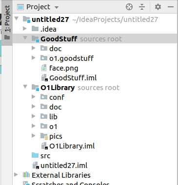

## Manual testing ##

[The complete list](https://github.com/Aalto-LeTech/intellij-plugin/labels/manual%20testing) of features that require writing
a manual testing manual. Marked with a github issue label "manual testing". Issue that aggregates key practices to manual testing and evnironments configuration: <a href="https://github.com/Aalto-LeTech/intellij-plugin/issues/18">decide and configure testing environments #18</a>.

  

    <a href="https://github.com/Aalto-LeTech/intellij-plugin/issues/9">making hints on missing plugins #9</a>
  

  

    <h5>Part 1. Checking missing plugins</h5>
    <ol>
      <li>Ensure "Scala" plugin is not installed <b>(File | Settings | Plugins | Marketplace)</b></li>
      <li>Restart an IDE</li>
      <li>Observe a notification saying
         
        <i>
        "A+
        The additional plugin(s) must be installed and enabled for the A+ plugin to work properly (Scala).
         
        <a href="">Install missing (Scala) plugin(s).</a>"
       </i>
      </li>
      <li>Click on the highlighted part of the notification, approve restart of the IDE</li>
      <li>After the restart is done, ensure there is no notification anymore</li>
    </ol>  
  

  

    <h5>Part 2. Checking disabled plugins</h5>
    <ol>
      <li>Ensure 'Scala' plugin is installed and disabled
        
      </li>
      <li>Restart an IDE</li>
      <li>Observe a notification
        
      </li>
      <li>Click on the highlighted part of the notification</li>
      <li>Check the notification became inactive
        
      </li>
      <li>After the restart is done, ensure there is no notification anymore</li>
    </ol>  
  

  

    <a href="https://github.com/Aalto-LeTech/intellij-plugin/issues/44">add new startup notification saying the plugin is in beta/dev #44</a>
  

  

    <h5>Checking the notification regard the current A+ Course plugin version</h5>
    <ol>
      <li>Ensure "A+ Course" plugin is installed <b>(File | Settings | Plugins | Installed)</b> and check the plugin version from the plugin window or <a href="https://plugins.jetbrains.com/plugin/13634-a-plugin-for-intellij/versions">online.</a></li>
      <li>Restart an IDE</li>
      <li>Observe a notification saying and ensure the version matches the one shown for the plugin.
         
        <i>
          "A+ Courses plugin is under development: You are using version <b>0.1.0</b> of A+ Courses plugin, which is a pre-release version of the plugin and still under development. Some features of this plugin are still probably missing, and the plugin is not yet tested thoroughly. Use this plugin with caution and on your own risk!
       </i>
      </li>
      <li>The notification should reamin after the restart is done.</li>
    </ol>  
  

  

    <a href="https://github.com/Aalto-LeTech/intellij-plugin/issues/30">install required
    dependancies for the project from LOCAL #30</a>
  

  

    <h5>Part 1.  Importing a module by double-clicking it</h5>
    <ol>
      <li>Create a new project.</li>
      <li>
        Open the <em>Modules</em> tool window (if it is not open).  You may have to wait a
        few seconds for the list of modules to be initialized.  If the initialization takes more
        than 10&nbsp;seconds, consider it an error.
      </li>
      <li>Select <em>GoodStuff</em> from the list and double click it.</li>
      <li>
        Ensure that <em>GoodStuff</em> and <em>O1Library</em> appear as loaded modules in the
        project tree, and their contents match the image below: 
         
        It shouldn't take longer than 5 seconds for modules to be imported.
      </li>
      <li>
        Ensure that <em>GoodStuff</em> and <em>O1Library</em> are marked <em>Installed</em> in the
        <em>Modules</em> tool window.
      </li>
    </ol>
  

  

    <h5>Part 2.  Importing a module using context menu.</h5>
    <ol>
      <li>
        Continuing from <strong>Part 1</strong>, right-click a non-installed module of your choice
        in the <em>Modules</em> tool window.  On Mac with only one mouse button, you may need
        to use some other gesture to open a context menu, like holding <em>Ctrl</em> key while
        clicking.  Use the way that is standard to the system.
      </li>
      <li>Ensure that a pop-up menu appears next to the mouse pointer.</li>
      <li>Click <em>Import A+ Module</em> menu item.</li>
      <li>
        Ensure that the module appears in the project tree.  If module has dependencies, those
        are imported too.  If other modules appear in the project tree in this step, you can assume
        they are dependencies of the module you chose and ignore them.
      </li>
      <li>
        Ensure that the module is marked <em>Installed</em> in the <em>Modules</em> tool window.
      </li>
    </ol>
  

  

    <h5>Part 3.  Importing multiple modules using toolbar button.</h5>
    <ol>
      <li>
        Continuing from <strong>Part 2</strong>, select multiple non-installed modules in the
        <em>Modules</em> tool window by clicking them while holding <em>Ctrl</em> key.
        Again, Mac may do things differently, so use the way to select multiple items that is
        standard to the system.
      </li>
      <li>
        Click <em>Import A+ Module</em> toolbar button on the top of the <em>Modules</em> tool
        window.  The button is denoted with a "download" icon.
      </li>
      <li>
        Ensure that the selected modules appear in the project tree.  Again, in case other
        modules appear there as well, assume they are appropriate dependencies and ignore them.
        
      </li>
      <li>
        Ensure that the modules you selected are marked <em>Installed</em> in the <em>Modules</em>
        tool window.
      </li>
    </ol>
  

  

  <a href="https://github.com/Aalto-LeTech/intellij-plugin/issues/64">
    IDEA should remember that some modules were previously installed #64
  </a>
  

  

    <h5>Part 1. Installing Modules</h5>
    <ol>
      <li>Create a new project.</li>
      <li>Install some course modules from the modules tool window.</li>
    </ol>
    
  

  

    <h5>Part 2. Removing Modules</h5>
    <ol>
      <li>
        From the project menu on the left, remove some modules from the project.
      </li>
      <li>
        Ensure that the removed modules are shown as not installed in the modules tool window.
      </li>
      <li>
        From the file system of the computer, delete a directory corresponding to an installed course module.
        The folders of the modules are located in the directory of the project.
      </li>
      <li>
        Ensure, that the modules corresponding to the deleted directories are shown as not installed in the modules tool
        window.
      </li>
    </ol>
  

  

    <h5>Part 3. Restarting IntelliJ</h5>
    <ol>
      <li>
        Ensure that some course modules are installed in the project and restart the IDE.
      </li>
      <li>
        Ensure that the previously installed modules are shown as installed in the modules tool window after restarting
        the IDE.
      </li>
    </ol>
  

  

  

    

      <a href="https://github.com/Aalto-LeTech/intellij-plugin/issues/66">implement REPL thingy #66</a>
    

    

      <h5>Part 1. Importing a module</h5>
      <ol>
        <li>Create a new project.</li>
        <li>
          Open the <em>Modules</em> tool window (if it is not open).  You may have to wait a
          few seconds for the list of modules to be initialized.  If the initialization takes more
          than 10&nbsp;seconds, consider it an error.
        </li>
        <li>Select <em>GoodStuff</em> from the list and double click it.</li>
        <li>
          Ensure that <em>GoodStuff</em> and <em>O1Library</em> appear as loaded modules in the
          project tree, and their contents match the image below: 
           
          It shouldn't take longer than 5 seconds for modules to be imported.
        </li>
      </ol>
    

        <h5>Part 2. Verifying the REPL</h5>
        <ol>
          <li>Ensure Scala Plugin is installed and enabled</li>
          <li>Ensure Scala SDK is set properly <b>(File | Project Structure | Global Libraries | Add | Scala SDK)</b></li>
          <li>
            Open REPL by choosing a folder or a file within <em>GoodStuff</em> module <a href="https://confluence.jetbrains.com/pages/viewpage.action?pageId=53326891">(how-to)</a>
          </li>
          <li>When the console opens, check, that the name of the REPL contains the name of the <em>GoodStuff</em> module</li>
          <li>Next, type into the REPL prompt: <i>sys.props("user.dir")</i>
          </li>
          <li>Make sure, that the output directory is where the <em>GoodStuff</em> module resides</li>
          <li>Next, type into the REPL prompt: <i>sys.props("java.class.path")</i></li>
          <li>Make sure, that the output classpath contains the <em>GoodStuff</em> module, the complete result should look approximately like this:
           
          </li>
        </ol>
      

