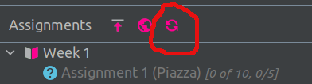

Manual testing
==============

### Notes

+ The menus of IntelliJ are bit different on Mac than on Linux/Windows.
  For example, to open settings on Linux, one can navigate to **File > Settings...**
  but on Mac, the same result is achieved with **IntelliJ IDEA > Preferences...**.

+ Similarly, on Mac one does not use right-click
  but, instead, clicks holding **Ctrl** key down.

### 0 Setup

**0.1** Make sure you are using a clean installment of
        **IntelliJ IDEA Community** version **2020.2**.
- You can download IntelliJ IDEA Community from https://www.jetbrains.com/idea/download.
- In case you use pre-existing installment of IntelliJ IDEA,
  you can use one of the following ways to restore to the default settings:

**0.1.A.** In the main window, choose **File > Manage IDE Settings > Restore Default Settings...**
- In the popup window, choose **Restore and restart**.

**0.1.B** In the startup window, choose **Configure > Restore Default Settings...**
- In the popup window, choose **Restore and restart**.

**0.2** When the IntelliJ IDEA opens first time, choose **Light** UI theme and
        click **Skip Remaining and Set Defaults**.

**0.3** Remove installed external plugins, if there are any.
- In the startup window, choose **Configure > Plugins** and open **Installed** tab.
- If there are **Downloaded** plugins on the top of the list,
  uninstall all of them, one by one.
- Restart IntelliJ IDEA.

### 1 Install **A+ Courses** plugin

**1.1** In the startup window, choose **Configure > Plugins**.

**1.2** Do one of the following options, depending on whether you are testing
        a pre-publish version of the plugin or a published version.

**1.2.A** Install a published version.
- Open **Marketplace** tab and search **A+ Courses** plugin.
- Ensure that the version is the one you want to test.
- Click **Install**.

**1.2.B** Install a pre-publish version.
- If you don't have a ZIP file yet, you can generate it.
  To get the source code, execute

      git clone https://github.com/Aalto-LeTech/intellij-plugin.git

  and navigate to the cloned directory.
  Checkout the branch/tag/commit you want to test, and execute
 
      ./gradlew buildPlugin
  
  Once the build is ready,
  the generated ZIP file can be found in `build/distributions`.
- In **Plugins** window, click the cog icon next to the tabs.
- From a popup menu, choose **Install Plugin from Disk...**
- Select the ZIP file on the popped-up file selector.

**1.3** ASSERTION: IntelliJ IDEA asks to install **Scala Plugin**.

**1.4** ASSERTION: IntelliJ IDEA requires a restart.

**1.5** Install **Scala Plugin** by clicking **OK**.

**1.6** Restart IntelliJ IDEA.

### 2 Initialize a new project

**2.1** In the startup window, click **Create New Project**.

**2.2** In **New Project** window, choose **Empty Project** on a left-hand side list.

**2.3** Click **Next**.

**2.4** On the next view, click **Finish**.

**2.5** If **Tip of the Day** window is shown,
        check **Don't show tips** and click **Close**. 

**2.6** ASSERTION: **Project Structure** window opens with **Modules** tab visible.

**2.7** Switch to **Project** tab.

**2.8** ASSERTION: **Project SDK** reads **\<No SDK\>**.

**2.9** Choose JDK 11 as **Project SDK**.
- If JDK 11 is not installed on the computer,
  choose **Add SDK > Download JDK...**
- On the window that opens,
  choose **AdoptOpenJDK (HotSpot)** as **Vendor**
  and **11.x.x** as **Version**,
  and click **Download**.

**2.10** Click **OK** to close **Project Structure** window.

### 3 About window

**3.1** From the main menu, choose **A+ > About A+ Plugin**.

**3.2** The about window is shown.

**3.3** Click the highlighted **A+ Courses Plugin website** link.

**3.4** ASSERTION: A+ Courses Plugin page on JetBrains website opens in the browser.

**3.5** Close the window by clicking **OK**.

### 4 Turn project into A+ project

**4.1** From the main menu, choose **A+ > Turn project into A+ course project**.

**4.2** On the dialog that opens, click **Cancel**.

**4.3** ASSERTION: The dialog closes but nothing else seems to happen.

**4.4** Open **A+ > Turn project into A+ course project** again.

**4.5** ASSERTION: **Leave IntelliJ settings unchanged** checkbutton is not checked.

**4.6** Check "leave unchanged" checkbox.

**4.7** Select the desired language of assignments submission and click **OK**.

**4.8** ASSERTION: **O1Library** appears as a module in the project tree.

**4.9** ASSERTION: **A+ Courses** tool window shows a list of O1 modules in **Modules** list.

**4.10** ASSERTION: **O1Library** is marked **Installed** in **Modules** list.

**4.11** Once again, navigate to **A+ > Turn project into A+ course project**.

**4.12** Leave the checkbox unchecked and click **OK**.

**4.13** The screen shows a dialog that tells the IDE will be restarted.

**4.14** Click **OK**.

**4.15** The IDE restarts.

**4.16** ASSERTION: The theme has changed to dark.

### 5 Installing modules

**5.1** On **Modules** list  tool window, double-click **RobotTribes**.

**5.2** ASSERTION: **RobotTribes** and **Robots** appear as modules in the project tree.

**5.3** ASSERTION: **RobotTribes** and **Robots** are marked **Installed** in **Modules** list.

**5.4** On **Modules** list, right-click **SwingExamples**.

**5.5** On the context menu that appears, choose **Install A+ module**.

**5.6** ASSERTION: **SwingExamples** appears as a module in the project tree.

**5.7** ASSERTION: **SwingExamples** is marked **Installed** in the modules list.

**5.8** On **Modules** list, select multiple uninstalled modules.
- Hold **Ctrl**/**Cmd** key down while clicking to select many items.

**5.9** Click the button with download icon
        on the top of the **Modules** list
        to install all selected modules.

**5.10** ASSERTION: The chosen modules appear in the project tree.

**5.11** ASSERTION: The chosen modules are marked **Installed** in **Modules** list.

**5.12** ASSERTION: All the installed modules have their dependencies correctly configured.
- To check this, navigate to **File > Project Structure... > Modules**
  and make sure none of the modules is underlined in red.
- Exit **Project Structure** window by clicking **Cancel**.

### 6 Using Scala REPL

#### Part I: Basic case

**6.1** Open REPL by choosing a folder or a file within **SwingExamples** module.
- Read [this](https://confluence.jetbrains.com/pages/viewpage.action?pageId=53326891)
  if you don't know how to open and use REPL.

**6.2** In **REPL configuration** window that opens, uncheck **Don't show this window again** checkbox.

**6.3** Click **OK**.

**6.4** ASSERTION: A REPL opens with **SwingExamples** in its title. 

**6.5** ASSERTION: Welcome message contains the **SwingExamples** as module name and a list of 
imported packages: **o1, o1.llama, o1.randomtext**.

**6.6** ASSERTION: Welcome message contains `[Ctrl+Enter]` as one of the available commands.

**6.7** Execute the following command in REPL:

    val RTA = RandomTextApp

**6.8** ASSERTION: Results of the command has no errors and looks alike the following image.

**6.9** Execute the following two commands in REPL:

    sys.props("user.dir")
    sys.props("java.class.path")

**6.10** ASSERTION: The output of the first statement is the directory of **SwingExamples** module.

**6.11** ASSERTION: The output of the second statement (classpath) contains **SwingExamples**.

**6.12** Close the REPL by clicking X next to its tab title.

**6.13** The window opens asking whether REPL should be terminated.
        Check **Remember, don't ask again** checkbox and click **Terminate**.

#### Part II: Changing parameters

**6.14** Reopen REPL by choosing a folder or a file within **SwingExamples** module.

**6.15** Again, uncheck **Don't show this window again** checkbox.

**6.16** Change **Working directory** to be the directory of **O1Library** module.
- Just replacing **SwingExamples** with **O1Library** in the path does the trick.

**6.17** Change value for **Use classpath and SDK of module** dropdown list to be **O1Library**.

**6.18** Click **OK**.

**6.19** ASSERTION: A REPL opens with **O1Library** in its title.

**6.20** In REPL, execute the same two commands as in **6.9**.

**6.21** ASSERTION: The output of the first statement is the directory of **O1Library** module.

**6.22** ASSERTION: The output of the second statement (classpath) contains **O1Library**
         (but not other modules, such as **SwingExamples**).

**6.23** Close the REPL.

#### Part III: Inconsistent parameters

**6.24** Reopen REPL by choosing a folder or a file within **O1Library** module.

**6.25** This time, leave **Don't show this window again** checkbox checked.

**6.26** Change **Working directory** to be the directory of **SwingExamples** module.

**6.27** Click **OK**.

**6.28** ASSERTION: A REPL opens with **O1Library** in its title.

**6.29** In REPL, execute the same two commands as in **6.9**.

**6.30** ASSERTION: The output of the first statement is the directory of **SwingExamples** module.

**6.31** ASSERTION: The output of the second statement (classpath) contains **O1Library**
         (but not other modules, such as **SwingExamples**).

**6.32** Close the REPL.

#### Part IV: Persistence of choice

**6.33** Reopen REPL by choosing a folder or a file within **O1Library** module.

**6.34** ASSERTION: **REPL Configuration** window does not show up.

**6.35** ASSERTION: A REPL opens with **O1Library** in its title.

**6.36** Execute the same two commands as in **6.9**.

**6.37** ASSERTION: The output of the first statement is the directory of **O1Library** module.

**6.38** ASSERTION: The output of the second statement (classpath) contains **O1Library**
         (but not other modules, such as **SwingExamples**).

**6.39** Close the REPL.

**6.40** Restart te IDE.

**6.41** Once the IDE has restarted, open the REPL by choosing any file.

**6.42** ASSERTION: **REPL Configuration** window does not show up.

**6.43** ASSERTION: A REPL opens.

**6.44** Close the REPL.

#### Part V: Settings reset.

**6.45** From the main menu, choose **A+ > Reset A+ Courses Plugin Settings**.

**6.46** Open REPL by choosing any file.

**6.47** ASSERTION: **REPL Configuration** window shows up.

**6.48** Close the window by clicking **Cancel**.

**6.49** ASSERTION: No REPL opens.

### 7 Removing a module

**7.1** Right-click **SwingExamples** in the project tree
        and choose **Remove Module** from the context menu.

**7.2** Confirm the removal by clicking **Remove** on a popup window.

**7.3** ASSERTION: **SwingExamples** no longer shows **Installed** in **Modules** list.

**7.4** Double click **SwingExamples** in **Modules** list.

**7.5** ASSERTION: **SwingExamples** shows up as a module in the project tree.

### 8 Authentication with A+ LMS

**8.1** From the main menu, choose **A+ > Set A+ Token**.

**8.2** Click on the highlighted **What's my token?** link.

**8.3** ASSERTION: Browser opens your profile page in A+ LMS (login, if asked).

**8.4** Copy **API Access Token** from the web page and insert it into the prompt, click **OK**.

**8.5** ASSERTION: The assignments tab is populated with weekly assignments.

**8.6** Close the IDE.

**8.7** Open the IDE with the project.
 
**8.8** ASSERTION: Assignments tab is still populated. If [safe password storage](https://jetbrains.org/intellij/sdk/docs/basics/persisting_sensitive_data.html?search=sensitive#storage) 
is activated in the OS.

### 9 Assignments submission

**9.1** Expand **Week 1** and select **Assignment 2 (GoodStuff)**, and hit 
**Submit A+ Assignment**.

**9.2** ASSERTION: The **Could not find module: The A+ Courses plugin could not find the 
module GoodStuff.** error is shown.

**9.3** Go to **Modules** tab and install **GoodStuff** module like described in **6.1**

**9.4** Repeat **9.1**.

**9.5** ASSERTION: **Submit Assignment** dialog is shown.

**9.6** Select **Submit as: > Submit alone**, click **OK**.

**9.7** ASSERTION: The **Assignment successfully sent for assessment: You will be notified here when
 feedback is available. (You may also always check any ... )** notification is shown.
 
### 10 Refreshing Modules and Assignments

**10.1** Hit the **Refresh Assignments** or **Refresh Modules** button.

**10.2** ASSERTION: Assignments submission has appeared in the list of corresponding submissions.
 
### 11 Checking the submission
 
**11.1** ASSERTION: The **Submission feedback available Feedback for Assignment 2 (GoodStuff) [0/5] is now 
available. Click here to open the feedback.** notification is shown.

**11.2** ASSERTION: Submission is added under the corresponding Assignment.

**11.3** Click on the hyperlink **Click here to open the feedback.**

**11.4** ASSERTION: Browser opens Submission page in A+ LMS (login, if asked).

**11.5** Select a submission and hit the **Open A+ Submission** button.

**11.6** ASSERTION: Browser opens Submission page in A+ LMS (login, if asked).

### 12 Filtering exercises

**12.1** Click **Filter Assignments** button (pink funnel icon) above the assignments tree.

**12.2** ASSERTION: **Non-submittable** and **Completed** menu items are checked.

**12.3** Uncheck **Non-submittable** menu item.  Note: This makes the exercise tree to collapse.

**12.4** ASSERTION: Non-submittable (that is, grayed out) assignments are no longer in the tree.

**12.5** Check **Non-submittable** menu item again.

**12.6** ASSERTION: Non-submittable assignments are shown again in the tree.

**12.7** Uncheck **Non-submittable** menu item again.

**12.8** Restart the IDE.

**12.9** ASSERTION: Non-submittable assignments are still invisible.

**12.10** ASSERTION: **Non-submittable** menu item is unchecked.

**12.11** From the main menu, choose **A+ > Reset A+ Courses Plugin Settings**.

**12.12** ASSERTION: Non-submittable assignments are shown again in the tree.

**12.12** ASSERTION: **Non-submittable** menu item is checked.

**12.13** Repeat 12.3-12.12 for the **Completed** filter
