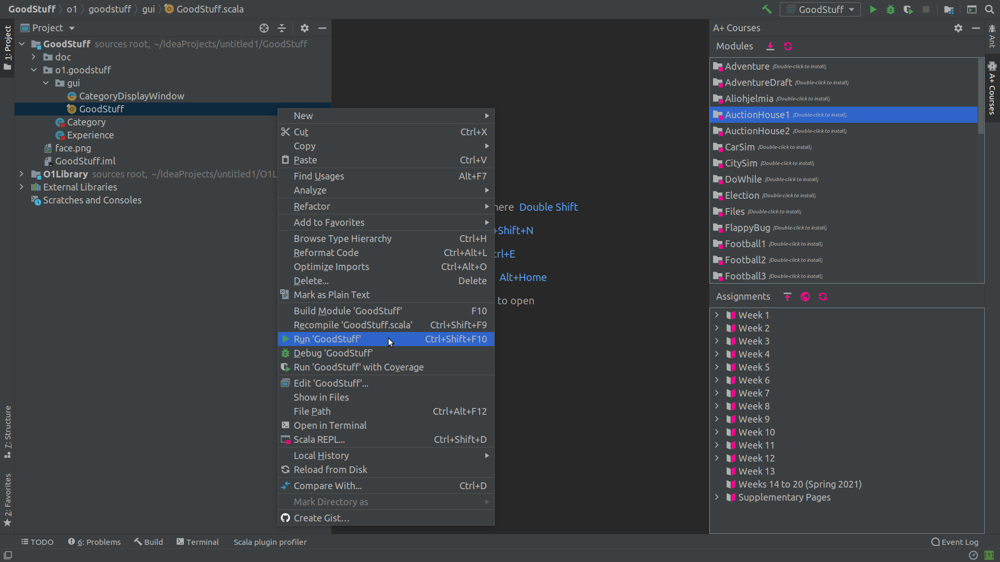

Troubleshooting the plugin
==============

### Verifying the setup

**0.** ensure the latest compatible version of IntelliJ IDEA Community Edition is installed (**2020.2.** or later).

**1.** update plugin to the latest version (you can check the latest version on [Plugin's official page](https://plugins.jetbrains.com/plugin/13634-a-courses/versions)), but at least **1.4**.

**2.** create a new project: [**File -> New -> Project...** and then **Empty Project**](https://plus.cs.aalto.fi/o1/2020/w01/ch02/#launch-intellij).

**3.** Turn project into an A+ Project: [**A+ -> Turn Project Into A+ Project**](https://plus.cs.aalto.fi/o1/2020/w01/ch02/#the-a-courses-plugin) (and choose the rest of the settings asked for in the pop-up dialog).

**4.** check the IDE for not having errors (you **should not** see the blinking red icon in the bottom-right corner as shown). If there are errors, please share the "stacktrace" text with the course staff.

**Image 1.** IntelliJ IDEA default error indicator

**5.** review the project structure for correctness: **File -> Project Structure ->** ...

**Project**

**Image 2.** Project Structure, Project Settings, Project View

**Modules**

**Image 3.** Project Structure, Project Settings, Modules View, Sources

**Image 4.** Project Structure, Project Settings, Modules View, Paths

**Image 5.** Project Structure, Project Settings, Modules View, Dependencies

**Libraries (Scala SDK)**

**Image 6.** Project Structure, Project Settings, Libraries View

**6.** download the **GoodStuff** module and run it by right-clicking and choosing **Run**

**Image 7.** Run **GoodStuff** from module context menu

**7.** start REPL on a **GoodStuff** module by right-clicking **Scala REPL...**

**Image 8.** Run REPL from **GoodStuff** module context menu

### [Known issues](https://github.com/Aalto-LeTech/intellij-plugin/labels/user-bug)

| #   | status        | description                                                                                                                                                                                                      |
|-----|---------------|------------------------------------------------------------------------------------------------------------------------------------------------------------------------------------------------------------------|
| 1.  | **problem**   | [scalac: Scala compiler JARs not found (module: '') aka "IDE complaining about not able to see the SDK (whitespaces and special characters in path)"](https://github.com/Aalto-LeTech/intellij-plugin/issues/360)|
|     | **status**    | solved                                                                                             |
|     | **solution**  | update to at least **1.3** version of the Plugin                                                   |
| 2.  | **problem**   | [assignments are not visible on Aalto Linux (VDI)](https://github.com/Aalto-LeTech/intellij-plugin/issues/371)                                                                                                   |
|     | **status**    | solved                                                                                             |
|     | **solution**  | it's an environment configuration issue and was solved by Aalto IT                                 |
| 3.  | **problem**   | [continuously being asked to re-enter the A+ token](https://plus.cs.aalto.fi/o1/2020/wNN/intellij/#additional-materials-for-special-cases)                                                                       |
|     | **status**    | not possible to solve due to the configuration of Aalto Linux on VDI                               |
|     | **affected**  | :angry: users who can't remember their very first Aalto password                                   |
|     | **solution**  | some, but [partial](https://plus.cs.aalto.fi/o1/2020/wNN/intellij/#additional-materials-for-special-cases)                                                                                                       |
| 4.  | **problem**   | [keymap imported by the plugin interferes with macOS's normal keyboard shortcuts](https://github.com/Aalto-LeTech/intellij-plugin/issues/292)                                                                    |
|     | **status**    | solved                                                                                             |
|     | **affected**  | all the :angry: Mac users                                                                          |
|     | **solution**  | [is described here](https://plus.cs.aalto.fi/o1/2020/wNN/faq/#im-on-a-mac-computer-and-intellij-doesnt-type-characters-such-as-the-dollar-and-square-brackets-what-to-do)                                        |
| 5.  | **problem**   | [yet another NPE in REPL](https://github.com/Aalto-LeTech/intellij-plugin/pull/380)                |
|     | **status**    | solved                                                                                             |
|     | **affected**  | :angry: < 10                                                                                       |
|     | **solution**  | since Plugin version **1.5**                                                                       |
| 6.  | **problem**   | [network error about A+ token containing whitespaces](https://github.com/Aalto-LeTech/intellij-plugin/issues/377)                                                                                                |
|     | **status**    | under investigation                                                                                |
|     | **affected**  | :angry: < 10                                                                                       |
|     | **solution**  | _temporary solution:_ submit from the [A+ Web interface](https://plus.cs.aalto.fi/o1/2020/)        |
| 7.  | **problem**   | [can't run program because of the missing **Run** in right-click menu](https://github.com/Aalto-LeTech/intellij-plugin/issues/381)                                                                               |
|     | **status**    | under investigation                                                                                |
|     | **affected**  | :angry: < 10                                                                                       |
|     | **solution**  | _temporary solution:_ re-installation of the SDK (remove existing, follow [the guide](https://plus.cs.aalto.fi/o1/2020/wNN/intellij/#step-3-5-fetch-the-jdk-toolkit-into-intellij))                              |
| 8.  | **problem**   | [local course file missing "language"](https://github.com/Aalto-LeTech/intellij-plugin/issues/315)                                                                                                               |
|     | **status**    | under investigation                                                                                |
|     | **affected**  | :angry: < 10                                                                                       |
|     | **solution**  | _temporary solution:_ [try re-creating the project](https://plus.cs.aalto.fi/o1/2020/w01/ch02/#launching-intellij-for-the-first-time)                                                                            |
| 9.  | **problem**   | [local course file missing "downloadAt"](https://github.com/Aalto-LeTech/intellij-plugin/issues/385)                                                                                                             |
|     | **status**    | under investigation                                                                                |
|     | **affected**  | :angry: < 10                                                                                       |
|     | **solution**  | _temporary solution:_ [try re-creating the project](https://plus.cs.aalto.fi/o1/2020/w01/ch02/#launching-intellij-for-the-first-time)                                                                            |